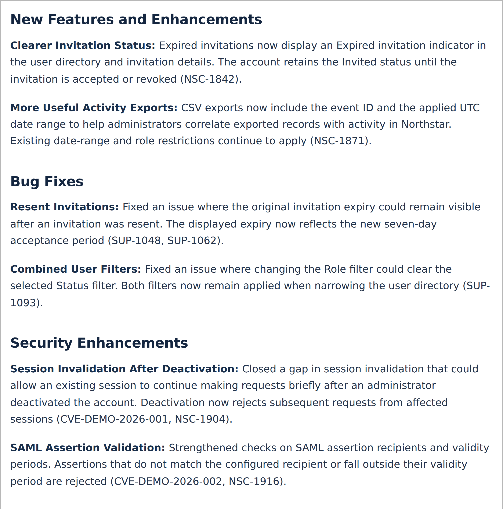
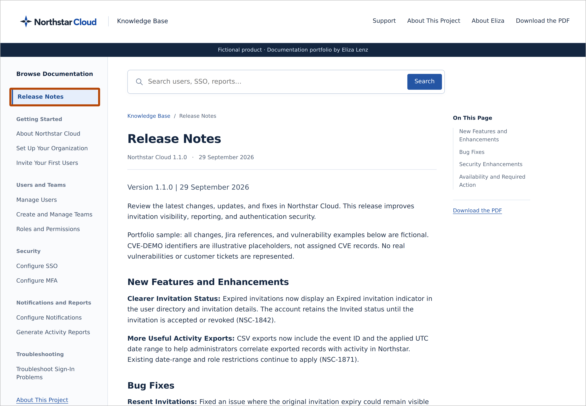
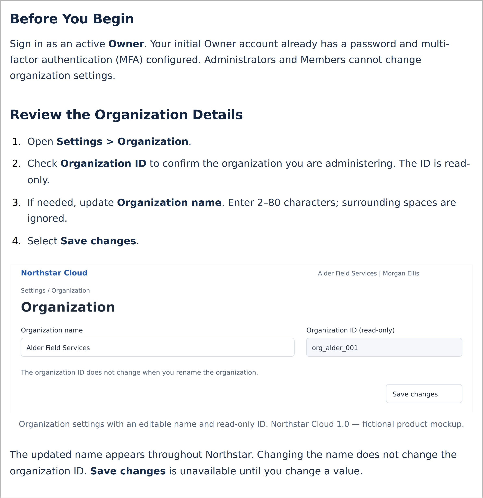
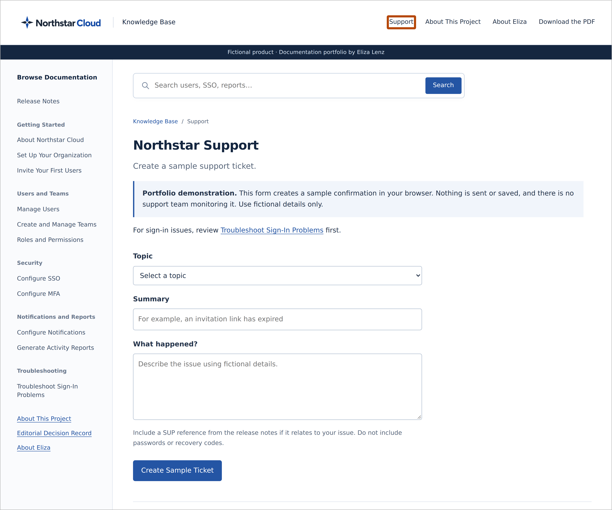
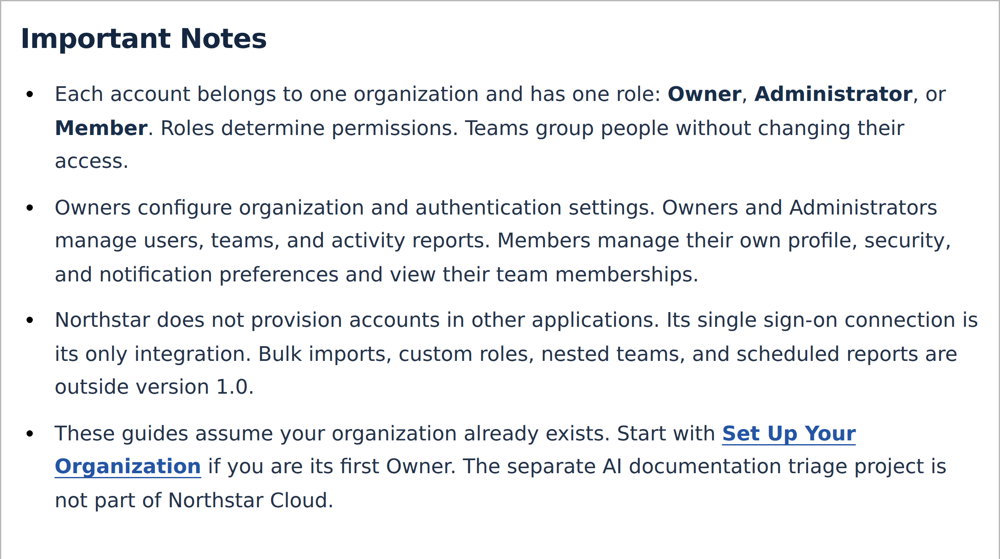
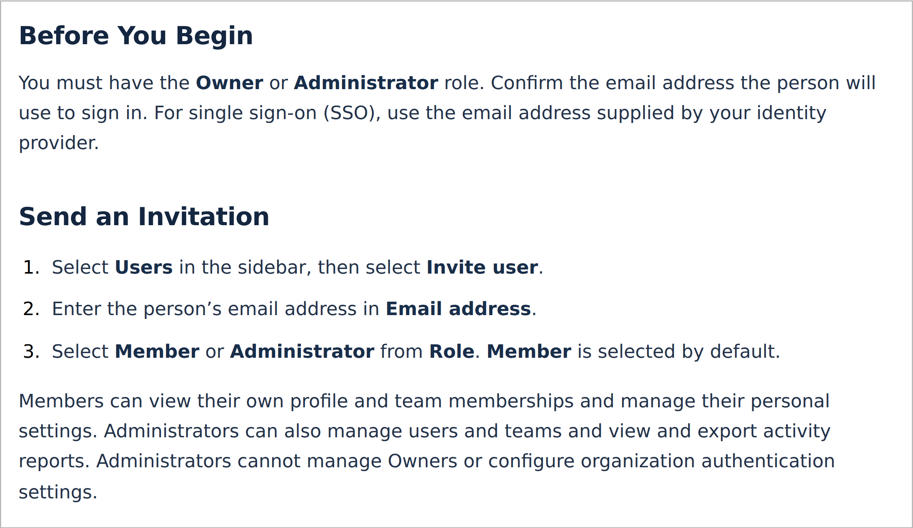
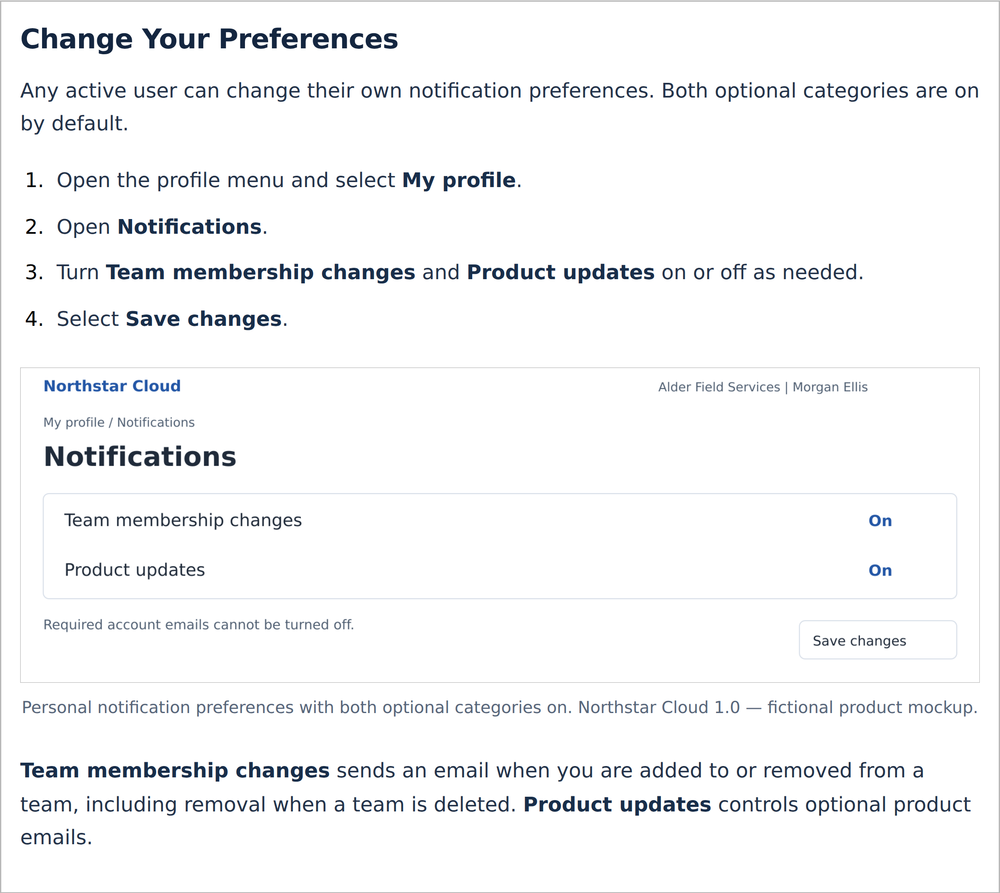
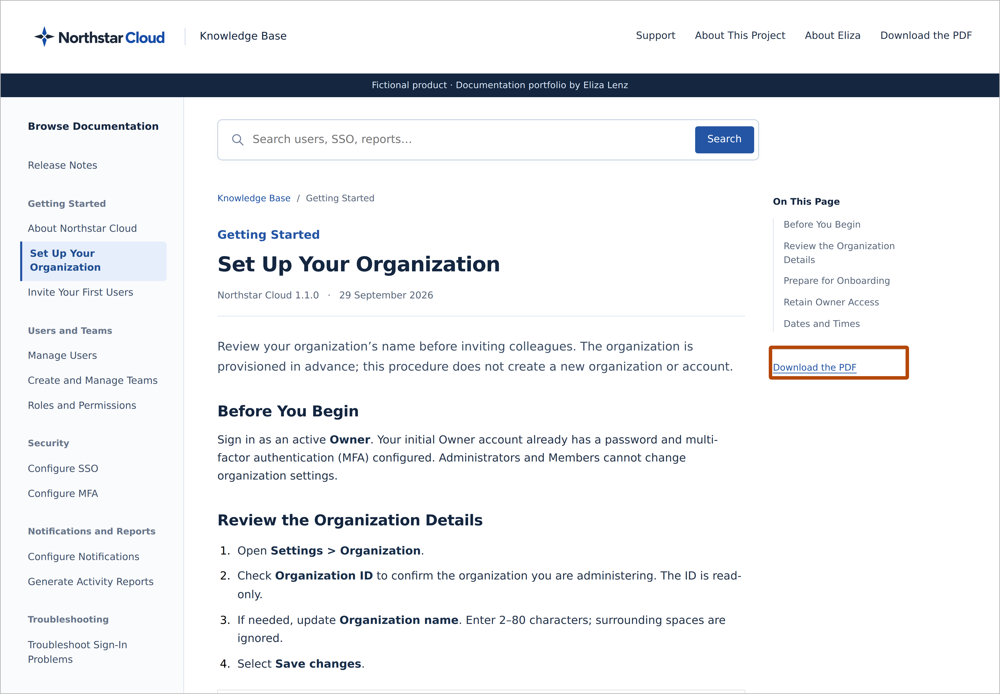

# Editorial Decision Record

Source: [Published article](https://docs.elizalenz.com/editorial-decisions/)

Eliza Lenz directed the formatting, organization, wording, and style of this knowledge base, using examples of documentation she had already authored to establish the approach. The decisions below are ordered by their impact on readers and task completion.

AI assisted with drafts, illustrations, document production, and implementation. For a real product, Eliza would also confirm technical accuracy with subject matter experts, check procedures against the application, and verify that the guidance applies to the intended users.

## 1. Release Notes That Explain Product Changes

**Request:** Replace baseline-focused release notes with a later release covering features, enhancements, bug fixes, and security changes. Include customer Jira references for reported issues and internal Jira references for engineering work. Use a colon after each bold change name, place ticket and vulnerability identifiers at the end of the relevant description, and remove the separate reference labels and Reference Information section.

**Rationale:** Readers need to know what changed, whether it affects them, and which reported issues were addressed. Customer and internal references serve different audiences; both groups use release notes.

**Result:** Version 1.1.0 separates enhancements, fixes, and security changes. Each change starts with a bold name and colon. NSC, SUP, and CVE-DEMO identifiers appear in parentheses at the end of the relevant description. The introductory note identifies all examples as fictional; a separate reference section is unnecessary.

Release Notes in the knowledge base, with bold change names and inline ticket references.

## 2. Order Information by User Impact

**Request:** Put Release Notes first in the page tree and order this record by the effect each decision has on users.

**Rationale:** Frequently sought and consequential information should be easy to find. Prioritizing user impact helps readers reach the most useful information first.

**Result:** Release Notes leads the documentation navigation. This record begins with decisions that affect understanding, navigation, and task completion before visual consistency and delivery formats.

A burnt-orange outline highlights Release Notes at the top of the documentation tree.

## 3. Visible and Usable Procedures

**Request:** Eliza provided examples of existing guides that she authored, which were then used as a reference for language styling, formatting, and layout.

**Rationale:** Readers need to follow a task in sequence and distinguish instructions from background information. A procedure should remain usable without relying on a screenshot.

**Result:** The generated guides follow the language styling, formatting, and layout established in Eliza’s authored examples. Procedures use visible numbering, identify where to begin, and separate actions from explanatory text. Role requirements appear before restricted tasks.

The organization setup article uses prerequisites and numbered instructions informed by Eliza’s authored guides.

## 4. A Clear Route to Support

**Request:** Include a Support link where users can find help and create a ticket when documentation does not resolve their issue.

**Rationale:** Readers who remain blocked need a clear next step without searching through unrelated documentation.

**Result:** Support is available in the header alongside the project information and PDF download. The demonstration form creates a clearly labelled sample confirmation without sending or storing the request.

The Support page, with a burnt-orange outline around the Support link in the header.

## 5. Scannable Important Notes

**Request:** Replace Understand the Scope with Important Notes and present the content in bullet form.

**Rationale:** A direct heading and separate bullets make constraints, role boundaries, and assumptions easier to scan.

**Result:** The About Northstar Cloud article groups the notes under Important Notes and presents each point as a distinct bullet.

The knowledge base presents Important Notes as individual bullets.

## 6. Plain Typography and Readable Steps

**Request:** Use a generic font and more generous line spacing, drawing on the supplied guides. Make procedure numbers regular-weight black.

**Rationale:** Familiar typography, clear spacing, and neutral numbering keep attention on the instructions. Numbers should indicate sequence without competing with the action text.

**Result:** The Word guides use Carlito at 11 pt with 1.3 line spacing. Web articles use a system sans-serif font. Step numbers are black and unbolded; actionable UI labels retain emphasis.

The invitation article uses the knowledge base’s system font, regular black step numbers, and emphasized interface labels.

## 7. Visible Screenshot Boundaries

**Request:** Apply a grey 1 px border directly to screenshot images.

**Rationale:** Readers need to see where an image begins and ends, particularly when a white screenshot sits on a white webpage. Embedding the border also preserves it when the image is reused in Confluence.

**Result:** Screenshot PNGs contain their own grey border, so the boundary does not depend on a document or website style.

The notification article shows a grey image boundary against the white page.

## 8. Balanced Headings and Useful Labels

**Request:** Reduce the article-title size, enlarge the section label, and remove redundant or competing labels across the pages. Remove the redundant Release Notes section label and use purpose-specific labels throughout the site.

**Rationale:** Headings should make the relationship between the section and article clear. Repeated labels add clutter without helping readers locate or understand information.

**Result:** Section labels and article titles have a more balanced size relationship. Redundant top labels are removed; contextual information appears in the appropriate page content.

## 9. Consistent Title Case

**Request:** Apply title case to all article titles, headings, and subheadings throughout the knowledge base and downloadable guides, including navigation and cross-references.

**Rationale:** Consistent capitalization helps readers recognize the same destination in navigation, cross-references, and downloads.

**Result:** The complete guide set and site headings use title case. This includes the headings within About Northstar Cloud, not just its article title. Exact interface labels retain their interface capitalization.

## 10. Formats Suited to Reading and Reuse

**Request:** Provide the documentation in several usable formats, with PDF as the article-download format. Repair the broken screenshot demonstrating the article PDF link.

**Rationale:** Readers need a stable, portable version for offline use. Editable source files support maintenance and reuse.

**Result:** Every article offers a PDF download. The complete documentation is available as a consolidated PDF, and the package retains editable Word sources and reusable image assets. The screenshot link has been corrected and the image replaced.

An article page, with a burnt-orange outline around its Download the PDF link.

## 11. Clear, Professional Screenshots

**Request:** Improve the quality of screenshots throughout the editorial record.

**Rationale:** High-quality screenshots look more professional and make the content easier for end users to read.

**Result:** The screenshots are rendered at higher resolution, with sharp text and a full-resolution version available when readers select an image.

## 12. Annotations That Add Value

**Request:** Remove text annotations from the screenshots while retaining the highlight boxes.

**Rationale:** The surrounding explanations and captions already describe the changes. Repeating that information inside the screenshot adds clutter without adding meaning.

**Result:** Text annotation labels have been removed. Captions and nearby explanations provide context, while outline boxes identify the relevant interface elements.

## 13. Eye-Catching Callout Boxes

**Request:** Make the callout boxes more prominent and change their colour so they do not blend into the site’s blue interface.

**Rationale:** Readers should notice the highlighted element quickly. A contrasting colour and thicker outline help draw attention to the relevant change.

**Result:** Thick burnt-orange outlines highlight Release Notes, the Support link, and the article PDF download. The boxes contrast with the navy and blue site design and have no labels or shadows.

## 14. Analytics to Inform Content Decisions

**Request:** Enable Google Analytics to track user behaviour, understand how visitors interact with the site, identify the most frequently viewed pages, and gather other useful engagement data.

**Rationale:** Usage data helps identify what readers seek out and where further investigation or documentation improvements may be useful.

**Result:** The Google Analytics tag is installed throughout the knowledge base. Reports can support future decisions about navigation, content priorities, and user engagement.

## 15. Clear Editorial Ownership and Professional Context

**Request:** Describe Eliza’s editorial role in the introductory paragraph without repeating it in a separate lead sentence. Place Read About Eliza above the download options and remove the unfinished Portfolio Website — Coming Soon placeholder.

**Rationale:** A concise introduction establishes responsibility without repetition. Related context belongs before download options, and links and labels should point to content that is available.

**Result:** The introductory paragraph attributes the editorial direction to Eliza. Read About Eliza appears above Download, and the unfinished portfolio placeholder has been removed from About Eliza and About This Project.
