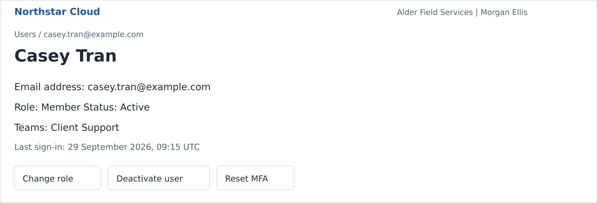

# Manage Users

Source: [Published article](https://docs.elizalenz.com/articles/manage-users/)

Use the user directory to review account status, change roles, and remove or restore access. Accepted accounts are retained when deactivated; Northstar does not permanently delete them.

## Before You Begin

You must be an **Owner** or **Administrator**. Administrators can manage other Administrators and Members, but cannot change an Owner’s role, status, or multi-factor authentication (MFA). You cannot change your own role, deactivate yourself, or reset your own MFA through user administration.

## Find a User

1. Select **Users** in the sidebar.
2. Enter a name or email address in **Search users**. Use **Status** and **Role** to narrow the results; the filters work together.
3. Select the user’s email address to open their details.

Casey Tran’s active account, viewed by an Owner. Northstar Cloud 1.0 — fictional product mockup.

An invited user has no name until they accept. An expired invitation still has the status **Invited**, with an **Expired invitation** indicator. Email addresses cannot be edited.

## Change a Role

Role changes end the affected user’s existing sessions. At their next sign-in, Northstar applies the new permissions and authentication requirements. You can change roles only for **Active** users.

1. Open the user’s details and select **Change role**.
2. Select the required **Role**. Only an Owner can assign or remove **Owner**.
3. Select **Save changes**.

For an Administrator, password sign-in requires local multi-factor authentication (MFA). A newly promoted user must enroll if they have not already done so. The last active Owner cannot be demoted or deactivated.

## Deactivate a User

Deactivation immediately blocks both password and single sign-on (SSO) access and ends existing sessions. The account retains its role and team memberships.

1. Open the active user’s details and select **Deactivate user**.
2. Review the affected user and the access consequences.
3. Confirm by selecting **Deactivate user**.

## Reactivate a User

1. On **Users**, filter **Status** to **Deactivated** and open the account.
2. Select **Reactivate user**.
3. Review the retained role and confirm by selecting **Reactivate user**.

The user becomes **Active** with their previous role and team memberships. They must still meet current SSO and MFA requirements. Northstar does not send a new invitation.

For a pending invitation, use **Resend invitation** or **Revoke invitation** instead. See **[Invite Your First Users](https://docs.elizalenz.com/articles/invite-your-first-users/)**.

## Reset Another User’s MFA

Reset local MFA when a user cannot use their authenticator or recovery codes. An Owner can reset another user’s MFA. An Administrator can reset MFA only for another Member. This action does not change MFA at your identity provider.

A reset removes the local enrollment and all recovery codes and ends the user’s sessions. If the user’s role or organization policy requires MFA, the user must enroll again at their next password sign-in.

1. Open the user’s details and select **Reset MFA**.
2. Check that the confirmation identifies the correct account.
3. Confirm by selecting **Reset MFA**.

## If an Action Is Unavailable

| **Situation** | **What to check** |
| --- | --- |
| Change role is unavailable | The account must be Active. You cannot change your own role or remove the last active Owner. |
| Owner controls are missing | An Administrator cannot manage an Owner. Ask another authorized Owner. |
| Reset MFA is unavailable | Check your authority and whether the user has a local enrollment. You cannot reset your own MFA here. |
| The email address already exists | Find the existing account. Resend an invitation or reactivate it, as appropriate; do not create a duplicate. |

**Related guides:** [Roles and Permissions](https://docs.elizalenz.com/articles/roles-and-permissions/); [Configure MFA](https://docs.elizalenz.com/articles/configure-mfa/); [Troubleshoot Sign-In Problems](https://docs.elizalenz.com/articles/troubleshoot-sign-in-problems/).
